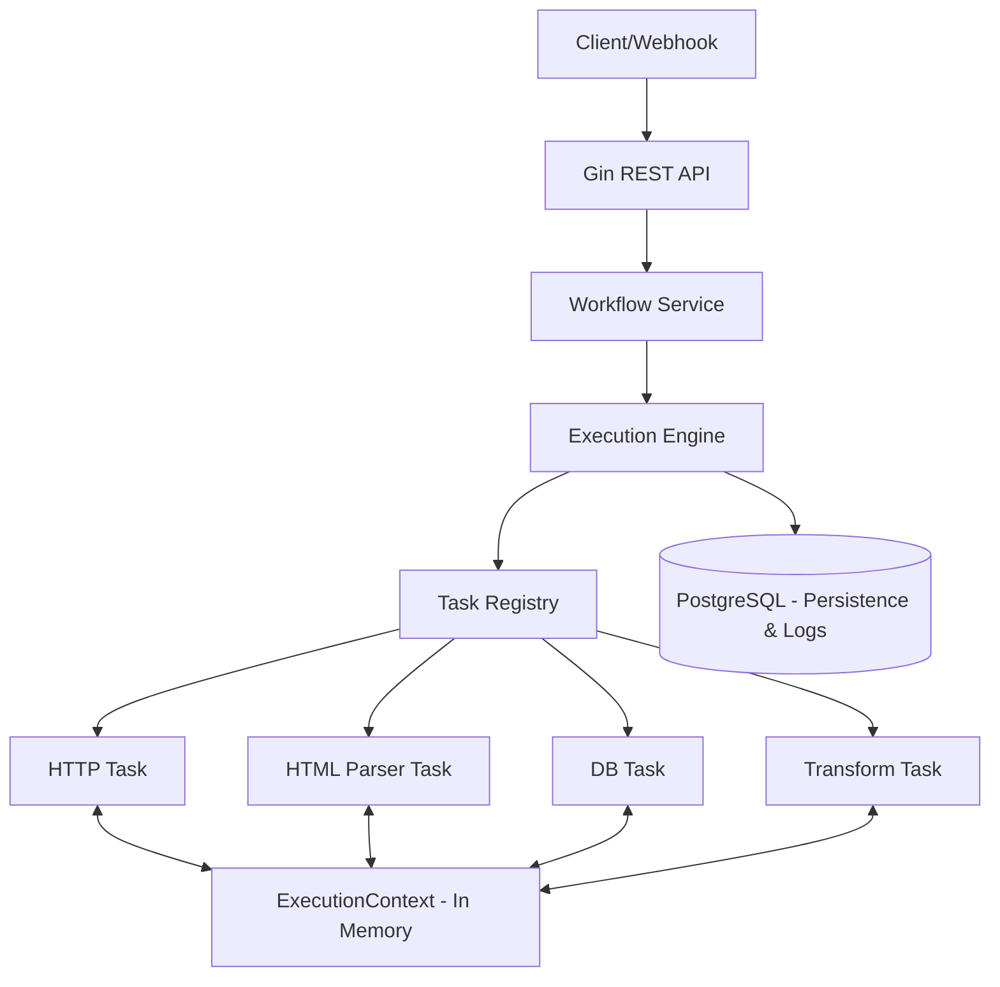
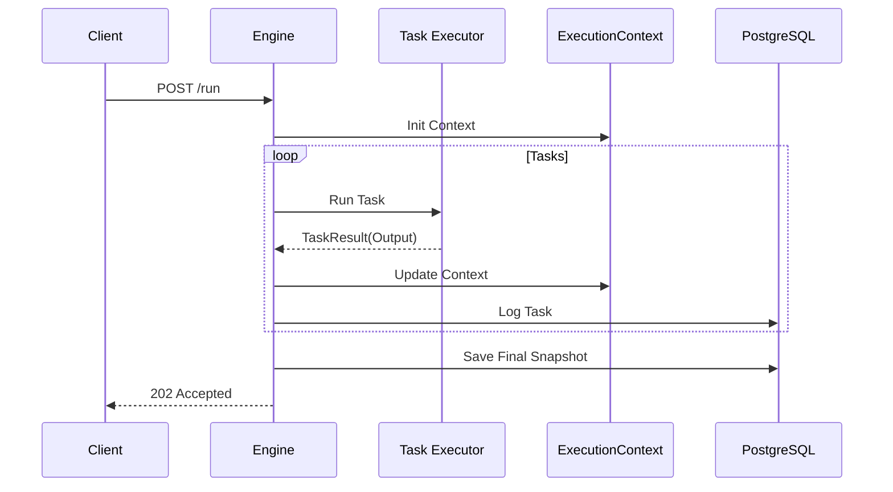

# Architecture Document: GoAutomation Hub

## 1. Introdução

Este documento detalha a arquitetura do **GoAutomation Hub**, um orquestrador de workflows *headless* e *API-first* escrito em Go. O sistema é projetado para demonstrar senioridade técnica através de um motor modular, contratos de execução rigorosos e gestão de estado eficiente, servindo como base para automações e scrapings estruturados.

## 2. Starter Template ou Projeto Existente

* **Decisão:** Projeto **Greenfield** desenvolvido do zero.
* **Layout:** Segue o **Standard Go Project Layout** (`/cmd`, `/internal`, `/pkg`).
* **Racional:** Maximizar a visibilidade da implementação manual e o domínio das ferramentas core da linguagem (Zero boilerplate de terceiros).

## 3. High Level Architecture

### 3.1 Technical Summary

O sistema utiliza um **Monólito Modular** com o padrão **Registry** para descoberta de executores. O motor é agnóstico ao tipo de tarefa, operando sobre uma interface comum `TaskExecutor` e um mapa de memória `ExecutionContext`.

### 3.2 High Level Project Diagram

### 3.3 Design Patterns

* **Registry Pattern:** Desacoplamento de tipos de tarefas do motor central.
* **Repository Pattern:** Abstração da camada de persistência (PostgreSQL).
* **Strategy Pattern:** Implementação polimórfica dos executores de nós.

## 4. Tech Stack

| Categoria | Tecnologia | Versão | Propósito |
| --- | --- | --- | --- |
| **Language** | Go | 1.21+ | Linguagem core e uso de `slog`. |
| **API Framework** | Gin-Gonic | v1.9+ | Router HTTP e Handlers. |
| **Database** | PostgreSQL | 15+ | Persistência relacional e JSONB. |
| **Driver/ORM** | pgx / GORM | v5 / v1.25 | Acesso a dados e produtividade. |
| **HTML Parser** | Goquery | v1.8+ | Scraping baseado em CSS Selectors. |
| **Templates** | `text/template` | Native | Motor de transformação de dados. |

## 5. Data Models

### 5.1 Entidades Principais

* **Workflow:** Define o nome e o JSON da estrutura de tarefas (`definition`).
* **Execution:** Instância de execução com `status` e `context_snapshot` (JSONB).
* **TaskLog:** Registos granulares de sucesso/falha/retry de cada passo.

## 6. Components

* **API Handler:** Validação de entrada e rotas.
* **Execution Engine:** Loop de orquestração e lógica de retry.
* **Execution Context:** Mapa thread-safe para partilha de dados inter-tasks.
* **Task Executors:** Implementações específicas do contrato `TaskExecutor`.

## 7. External APIs

* **Airbnb:** Alvo de scraping para validação do motor.
* **Slack/Discord:** Alvos de notificações via Webhook (Outbound).

## 8. Core Workflows

### 8.1 Happy Path Execution

## 9. REST API Spec

* `POST /workflows`: Registo de novos fluxos.
* `POST /workflows/:id/run`: Disparo assíncrono (202 Accepted).
* `GET /executions/:id`: Monitorização de status e logs.

## 10. Infrastructure

* **Docker Compose:** Orquestração de `app` + `postgres`.
* **Volumes:** Persistência de dados do PostgreSQL.
* **Env Vars:** Configurações de DB e Log via ficheiro `.env`.

---

*Documento gerado seguindo o framework BMAD-METHOD™*

---
