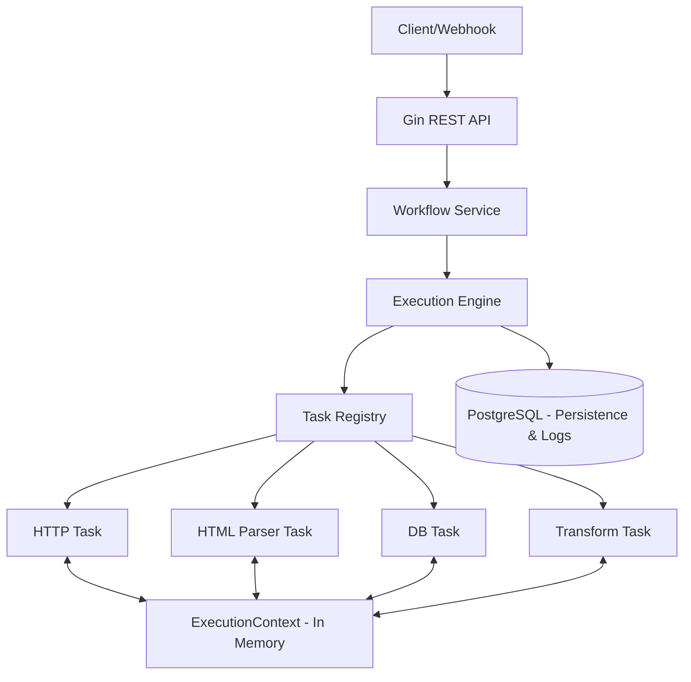

# 3. High Level Architecture

## 3.1 Technical Summary

O sistema utiliza um **Monólito Modular** com o padrão **Registry** para descoberta de executores. O motor é agnóstico ao tipo de tarefa, operando sobre uma interface comum `TaskExecutor` e um mapa de memória `ExecutionContext`.

## 3.2 High Level Project Diagram

## 3.3 Design Patterns

* **Registry Pattern:** Desacoplamento de tipos de tarefas do motor central.
* **Repository Pattern:** Abstração da camada de persistência (PostgreSQL).
* **Strategy Pattern:** Implementação polimórfica dos executores de nós.
