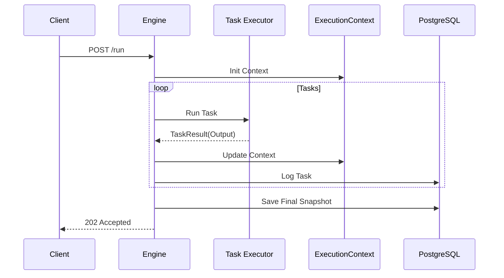

# 8. Core Workflows

## 8.1 Happy Path Execution

```mermaid
sequenceDiagram
    participant C as Client
    participant E as Engine
    participant X as Task Executor
    participant CTX as ExecutionContext
    participant DB as PostgreSQL

    C->>E: POST /run
    E->>CTX: Init Context
    loop Tasks
        E->>X: Run Task
        X-->>E: TaskResult(Output)
        E->>CTX: Update Context
        E->>DB: Log Task
    end
    E->>DB: Save Final Snapshot
    E-->>C: 202 Accepted

```
